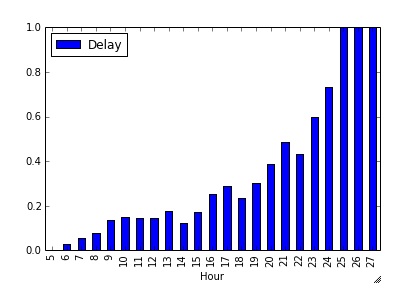

# FlightDelays

I set out to take data on obsereved historical flights and create a model that successfully predicts flight delays, using Python's Sci-Kit library. To create a predictive model and to understand the contributing factors to the model.

* [ipython notebook](https://github.com/robertdavidwest/FlightDelays/blob/master/FlightDelays/analysis/run_model.ipynb)

## Data Sources

The final dataset used to train the model was comprised of three different data sources:

1. Flight level data from the [Bureal of Transportation Statistics](http://www.transtats.bts.gov/DL_SelectFields.asp?Table_ID=236&DB_Short_Name=On-Time)
2. Daily Weather information at both the origin and destination airport [ncdc.noaa.gov](http://www.ncdc.noaa.gov/cdo-web/datasets/)
3. Aircraft specific information from [registry.faa.gov](http://registry.faa.gov/aircraftinquiry/NNum_Results.aspx?NNumbertxt=N325US)
 
## The Model

* The model was trained and tested using data from 2013 flights to predict flight delays in 2014
* A flight delay was defined as any flight that took off more than 15 minutes after its scheduled departure time
* The final model used to predict flight delays was a RandomForestClassifier trained on data from all 3 file sources.

## Summary

* I used a single airport (JFK) to train the model and find the best fit. I then applied this methodology to the top 5 busiest airports in the united states by total passengers boarding:
	* Atlanta (ATL)
	* Los Angeles (LAX)
	* O'Hare - Chicago (ORD)
	* Dallas/Fort Worth (DFW)
	* John F. Kennedy - New York (JFK)
 
	to observe model performance and whether factor siginificance would differ by airport

* Across the 5 airports the distribution of flight delays is similar (data from 2013):

		                 ATL            LAX            ORD            DFW           JFK
		OnTime Flights   0.811248       0.807899       0.718161       0.767909      0.813833
		Delayed Flights  0.188752       0.192101       0.281839       0.232091      0.186167
		Total  			 267,647 		 170,796        208,818        211,232       83,742

Using 2013 data to train this model, the following represents the model's performance on the 2014 data:
	
* The model performed similarly across the 5 airports with the best predictive power seen at JFK
* Across all 5 airports the two most significant factors contributing to flight delays were 'Hour' the Hour in the day and 'AirTime' the total flight time. Both of which had a negative correlation with Delays. i.e. the later in the day you're flight is scheduled to leave and the longer your flight, the more likely a delay

	
		
	NOTE: the hours between midnight and 3am were recoded as 24 to 27 respectively. 
	
* The Origin weather information was surprizingly consistent across all aiports despite the  different weather conditions seen in the different locations.
* For all aiports but Atlanta, the third most significant factor was the temperature (daily high) at the destination airport. Interestingly Atlanta sees a boost in significance of the year of Manufacteur of the aircraft

## Model Results

	
	MODEL PERFORMANCE METRICS
	-------------------------
	
	                ATL       LAX       ORD       DFW       JFK
	Precision  0.528227  0.612642  0.572036  0.609801  0.582480
	Recall     0.142244  0.122005  0.226480  0.177175  0.244387
	F1         0.224132  0.203487  0.324488  0.274574  0.344313
	Accuracy   0.814117  0.816518  0.734237  0.782718  0.826718
	
	
	FACTOR SIGINIFICANCE - TOP 5 FACTORS 
	------------------------------------
	              ATL		       LAX		        ORD             DFW             JFK
	   Feature  Score  Feature   Score   Feature  Score   Feature  Score Feature   Score
	1. Hour     0.17   Hour       0.18   Hour      0.17   Hour     0.18  Hour       0.21
	2. AirTime  0.11   AirTime    0.14   AirTime   0.13   AirTime  0.15  AirTime    0.11
	3. MFR Year 0.07   DestTMAX   0.07   DestTMAX  0.07   DestTMAX 0.08  DestTMAX   0.06
	4. DestTMIN 0.07   DestTMIN   0.07   DestTMIN  0.07   DestTMIN 0.08  DestTMIN   0.06
	5. DestTMAX 0.07   DayofMonth 0.07   Dest      0.06   Dest     0.07  OriginTMIN 0.05
	
	
## Details	

* To see more detail on model selection see the [ipython notebook](https://github.com/robertdavidwest/FlightDelays/blob/master/FlightDelays/analysis/run_model.ipynb)

## README

An [sklearn](http://scikit-learn.org/stable/) model used to predict Flight Delays using data obtained from 3 different sources:

* Flight data from the [Bureal of Transportation Statistics](http://www.transtats.bts.gov/DL_SelectFields.asp?Table_ID=236&DB_Short_Name=On-Time)
* Weather data from (http://www.ncdc.noaa.gov/cdo-web/datasets/)
* Aircraft specific data from (http://registry.faa.gov/aircraftinquiry/NNum_Results.aspx?NNumbertxt=N325US)

This module will instruct you on how to obtain, and combine all of the data above and then describe the process of predicting Flight Delays using a [RandomForestClassifier](http://scikit-learn.org/stable/modules/generated/sklearn.ensemble.RandomForestClassifier.html)

## Dependencies 
	
* Install packages `sklearn`, `matplotlib`, `pandas`, `numpy` and `geopy` using:

		$ pip install <package_name>

* Install package `flyingpandas` by cloning and following installation instructions from [here](https://github.com/robertdavidwest/flyingpandas)

## Get Data Instructions

NOTE: The following steps could easily be simplified to a single run file once the process is final.
The model assumes you already have the two data files `airports new.xlt` and `carriers.xls` saved in `output_dir`.

1. In the file `FlightDelays.config.py` enter the variables `output_dir` (the directory used to store all data) and `hdf_path` (the name of the HDF5 file used to store data) e.g.
	 
		# config.py
		output_dir = '/Users/username/Documents/airports_data/
		hdf_path = '{}/airline_data.h5'.format(output_dir)

2. run the script `FlightDelays.data.get_flight_data.py` to download flight level data files. Input the years you would like to include in the variable `years`. The resulting csv files will be saved in `output_dir`
3. Download the weather files needed using your browser or otherwise from the ftp server using this url: [ftp://ftp.ncdc.noaa.gov/pub/data/ghcn/daily/by_year/2016.csv.gz](ftp://ftp.ncdc.noaa.gov/pub/data/ghcn/daily/by_year/{year}.csv.gz). Be sure to replace {year} with the desired year of data
4. Unzip these files by running `FlightDelays.data.get_weather_data.py`
5. Add the flight level data and weather data to the HDF5 store by running script `FlightDelays.data.csv_to_hdf5.py` (again specifying the variable `years`)
6. To obtain the aircraft level data file, use the scraper by running the script: `FlightDelays.data.get_plane_level_data.py`. This will create an xlsx file `plane_info.xlsx` in `output_dir` using all Tail numbers available from the flight level data now stored in the HDF5 store.
7. Finally run the script `FlightDelays.data.merge_data.py`. This will use the `geopy` module to merge daily weather data onto the flight data. It will then merge all needed data files into a single flatfile. If memory is an issue, this process can be altered to use chunking

